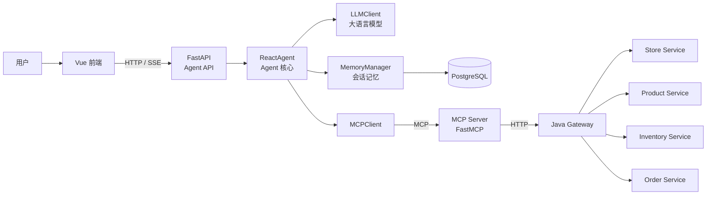
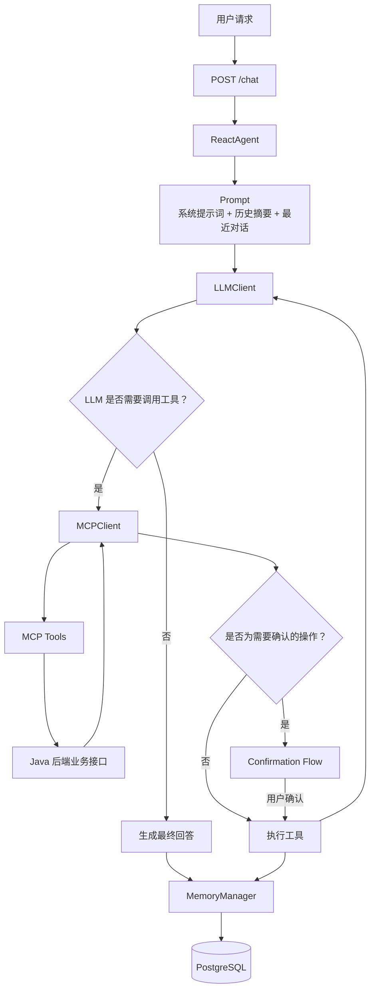
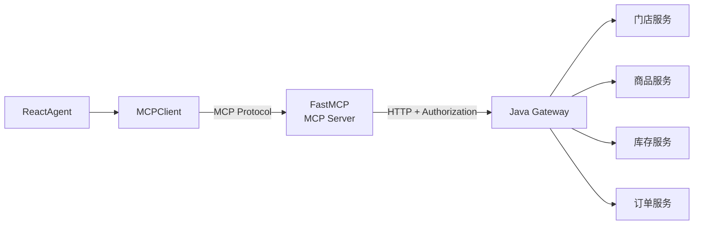
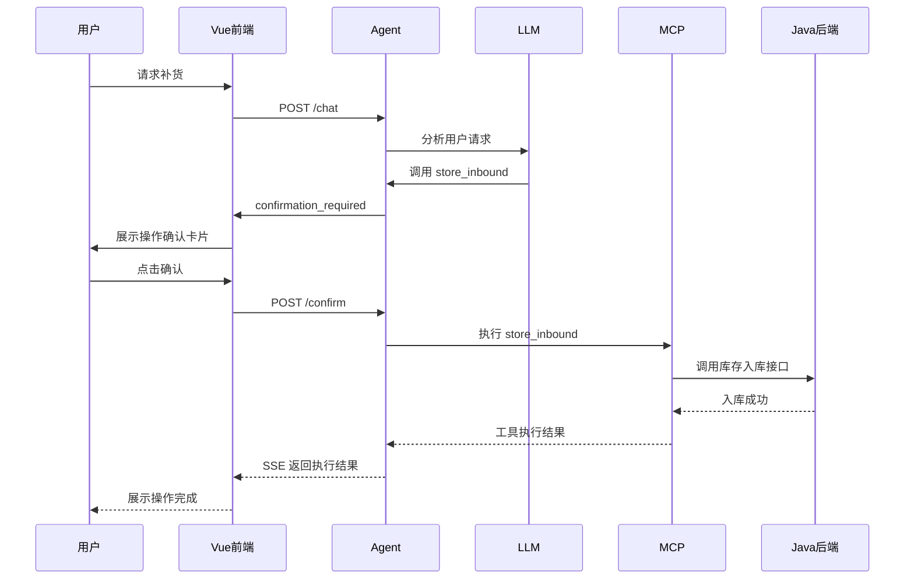

# StoreMind Agent

StoreMind Agent 是 StoreMind 智能门店管理与经营决策分析平台的 AI Agent 服务，负责接收用户自然语言请求，通过 LLM 进行任务分析，并根据需要调用 MCP 工具访问 Java 后端业务服务。

## 一、技术栈

| 技术         |      版本 | 作用                 |
| ---------- | ------: | ------------------ |
| Python     |  3.13.1 | Agent 运行环境         |
| OpenAI SDK |  3.14.0 | 调用大语言模型            |
| FastMCP    |   3.4.4 | MCP Server         |
| MCP        |  1.30.0 | MCP 协议及 CLI        |
| FastAPI    | 0.141.1 | 提供 HTTP / SSE 接口   |
| Requests   |  2.34.2 | HTTP 请求            |
| asyncpg    |  0.30.0 | PostgreSQL 异步数据库访问 |
| Pydantic   |       - | 请求数据模型与数据校验        |

## 二、项目整体架构

StoreMind Agent 与 Java 后端属于两个独立项目，但是运行时协同工作。



## 三、Agent 内部架构



## 四、FastAPI 接口

### 1. 对话接口

```http
POST /chat
```

请求：

```json
{
    "question": "帮我分析一下当前门店库存",
    "conversation_id": "xxx"
}
```

请求头：

```http
Authorization: Bearer xxx
```

该接口通过 SSE 向前端持续返回 Agent 处理过程中的事件。

### 2. 操作确认接口

```http
POST /confirm
```

请求：

```json
{
    "run_id": "xxx",
    "approved": true
}
```

用于用户确认 Agent 即将执行的业务修改操作。

### 3. 会话列表

```http
GET /conversation/list
```

用于获取当前用户拥有的会话列表。

### 4. 会话内容

```http
GET /conversation/{conversation_id}
```

用于获取指定会话的历史消息。

接口会根据 JWT 中的用户身份验证会话归属，防止访问其他用户的会话。

## 五、Agent 核心组件

### ReactAgent

Agent 的核心控制模块，主要负责：

1. 接收用户问题
2. 获取会话历史
3. 获取历史摘要
4. 构造 Prompt
5. 调用 LLM
6. 判断是否需要调用工具
7. 执行 MCP Tool
8. 根据工具结果继续推理
9. 生成最终回答
10. 保存会话消息
11. 触发历史消息摘要

整体流程：

```text
用户问题
   ↓
ReactAgent
   ↓
读取 Memory
   ↓
构造 Prompt
   ↓
LLM
   ↓
是否需要工具？
   ├── 否 → 最终回答
   │
   └── 是
        ↓
      MCP Tool
        ↓
      获取业务数据
        ↓
      LLM继续分析
        ↓
      最终回答
```

### LLMClient

`LLMClient` 负责与大语言模型进行交互。

主要功能：

* 普通对话
* Tool Calling
* 对话标题生成
* 历史会话摘要生成

### MCPClient

`MCPClient` 负责连接 MCP Server，并向 Agent 提供可调用的业务工具。

## 六、MCP 架构

StoreMind Agent 通过 `MCPClient` 连接 FastMCP Server，MCP Server 负责将 Java 后端的业务能力封装成 Agent 可以调用的工具。



### 当前 MCP Tool

目前 MCP Server 提供以下 5 个工具：

| Tool                          | 功能                 | 操作类型 |
| ----------------------------- | ------------------ | ---- |
| `get_store_sales_performance` | 查询指定门店在指定时间段内的销售情况 | 查询   |
| `get_store_inventory`         | 查询指定门店的库存情况        | 查询   |
| `store_inbound`               | 向指定门店批量进货          | 修改   |
| `conditional_search_stores`   | 根据省、市、区等条件分页查询门店   | 查询   |
| `check_product_list`          | 根据商品分类分页查询可供进货的商品  | 查询   |

### 1. get_store_sales_performance

根据门店编号查询指定时间范围内的销售情况。

参数：

```text
store_code
begin_time
end_time
```

其中 `begin_time` 和 `end_time` 为可选参数。

调用流程：

```text
Agent
 ↓
get_store_sales_performance
 ↓
MCP Server
 ↓
GET /stores/sales/performance/{store_code}
 ↓
Java Gateway
 ↓
门店销售数据
```

### 2. get_store_inventory

根据门店编号查询当前库存情况。

参数：

```text
store_code
```

调用流程：

```text
Agent
 ↓
get_store_inventory
 ↓
MCP Server
 ↓
GET /stores/inventory/{store_code}
 ↓
Java Gateway
 ↓
库存数据
```

返回的库存信息可以用于 Agent 判断商品库存状态，并结合销售数据进行补货分析。

### 3. store_inbound

向指定门店批量进货。

参数：

```text
store_id
product_list
```

其中 `product_list` 中每个商品包含：

```json
{
    "product_id": 2,
    "quantity": 10
}
```

该工具会调用 Java 后端：

```text
POST /inventory/inbound
```

并设置：

```json
{
    "recordChangeType": 0
}
```

由于该工具会直接修改门店库存，因此属于**业务修改工具**，需要经过用户确认后才能执行。

调用流程：

```text
Agent
 ↓
store_inbound
 ↓
需要用户确认
 ↓
用户确认
 ↓
MCP Server
 ↓
POST /inventory/inbound
 ↓
Java Gateway
 ↓
Inventory Service
 ↓
库存增加
```

### 4. conditional_search_stores

根据条件分页查询门店信息。

参数：

```text
page_num
province
city
district
```

其中省、市、区均为可选查询条件。

调用接口：

```text
GET /stores/list
```

该工具主要用于帮助 Agent 根据用户提出的地区条件查找门店。

例如：

```text
查询天津市北辰区有哪些门店
        ↓
conditional_search_stores
        ↓
获取符合条件的门店
```

### 5. check_product_list

分页查询可供进货的商品。

参数：

```text
category_id
page_num
```

商品分类：

```text
0 - 无条件全查
1 - 饮料
2 - 零食
3 - 日用品
4 - 粮油
5 - 家具
6 - 化妆品
7 - 服装
8 - 其他
```

调用接口：

```text
GET /products/list
```

该工具可以与 `store_inbound` 配合使用。

例如：

```text
用户：给门店补一些饮料
        ↓
check_product_list
        ↓
查询饮料商品
        ↓
get_store_inventory
        ↓
分析当前库存
        ↓
Agent 给出补货建议
        ↓
用户确认
        ↓
store_inbound
        ↓
完成入库
```

### MCP 鉴权

MCP Server 调用 Java Gateway 时，会从 MCP 请求上下文中获取用户传递的 `Authorization`。

```text
Vue
 ↓
Authorization: Bearer <JWT>
 ↓
FastAPI Agent
 ↓
MCPClient
 ↓
MCP Server
 ↓
获取 Authorization
 ↓
Java Gateway
 ↓
JWT 鉴权
```

因此 Agent 调用 MCP Tool 时，用户身份能够继续传递到 Java 后端的鉴权体系中。


## 七、操作确认机制

为了避免 Agent 直接修改业务数据，StoreMind 对修改类 Tool 增加了确认机制。

例如：

```text
用户：帮我给 Pepsi 补货 10 件
```

Agent 判断需要调用：

```text
store_inbound
```

由于该工具会修改库存，因此不会立即执行。



## 八、Memory 会话记忆

Agent 使用 PostgreSQL 保存会话信息。

```text
conversation
    ↓
保存会话基本信息、标题、用户ID、历史摘要

conversation_message
    ↓
保存具体的用户消息和 Agent 消息
```

当前记忆机制分为两部分：

```text
长期记忆
    ↓
conversation.summary
    ↓
历史对话摘要

短期记忆
    ↓
conversation_message
    ↓
最近未被摘要的历史消息
```

当未摘要消息达到指定数量后：

```text
未摘要消息达到阈值
        ↓
获取需要压缩的历史消息
        ↓
LLM 生成新的摘要
        ↓
更新 conversation.summary
        ↓
将对应消息标记为 is_summarized = true
```

## 九、鉴权

Agent 接收前端传递的：

```http
Authorization: Bearer <JWT>
```

Agent 从 JWT 中获取用户 ID。

用户身份用于：

* 会话创建
* 会话访问权限验证
* 会话列表查询
* MCP 请求鉴权
* 防止用户访问其他用户的会话

整体流程：

```text
Vue
 ↓
Authorization
 ↓
FastAPI
 ↓
JWT解析
 ↓
user_id
 ↓
MemoryManager
 ↓
验证 conversation 所属用户
```

同时 Agent 调用 MCP Server 时继续传递 Authorization，使 MCP Server 可以继续访问 Java Gateway 的鉴权体系。

## 十、项目结构

```text
StoreMindAgent/
│
├── Agent/
│   ├── agent.py
│   └── ...
│
├── Memory/
│   ├── database.py
│   └── ...
│
├── MCP/
│   └── ...
│
├── main.py
├── JwtUtil.py
├── requirements.txt
├── .env
├── .gitignore
└── README.md
```

## 十一、运行关系

StoreMind Agent 与 Java 后端是两个独立项目。

```text
StoreMind 系统
│
├── StoreMind-Java
│   │
│   ├── Gateway
│   ├── Store Service
│   ├── Product Service
│   ├── Inventory Service
│   └── Order Service
│
└── StoreMind-Agent
    │
    ├── FastAPI
    ├── ReactAgent
    ├── LLMClient
    ├── MCPClient
    └── MemoryManager
```

两个项目通过 HTTP / MCP 协同运行，但代码仓库相互独立。
