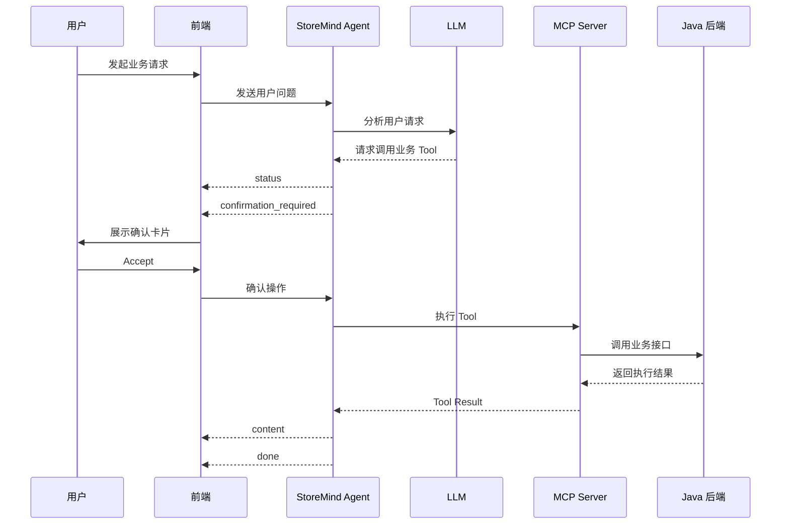

# StoreMind Agent 通信协议说明

## 一、协议概述

StoreMind Agent 采用 **Server-Sent Events（SSE）** 向前端持续推送 Agent 执行过程中的事件。

一次完整的 Agent 任务可能包含多个事件，例如：

```text
status
  ↓
content
  ↓
status
  ↓
confirmation_required
  ↓
用户确认
  ↓
status
  ↓
content
  ↓
done
```

前端根据事件中的 `type` 字段判断当前事件类型，并执行对应的 UI 操作。

---

# 二、SSE 事件类型

当前 Agent 支持以下 5 种核心事件：

| 类型   | `type`                  | 作用                |
| ---- | ----------------------- | ----------------- |
| 普通内容 | `content`               | 返回 Agent 生成的文本    |
| 执行状态 | `status`                | 返回 Agent 当前执行状态   |
| 执行错误 | `error`                 | 返回执行过程中产生的错误      |
| 操作确认 | `confirmation_required` | 请求用户确认即将执行的业务操作   |
| 执行完成 | `done`                  | 表示当前 Agent 任务执行完成 |

---

## 1. 普通内容事件

用于向前端返回 Agent 生成的文本内容。

```json
{
    "type": "content",
    "content": "当前门店库存整体正常，部分商品存在补货需求。"
}
```

### 字段说明

| 字段        | 类型     | 说明            |
| --------- | ------ | ------------- |
| `type`    | String | 固定为 `content` |
| `content` | String | Agent 生成的文本内容 |

由于 Agent 使用 SSE 流式返回，因此同一次任务中可以产生多个 `content` 事件。

例如：

```text
data: {"type":"content","content":"当前门店"}

data: {"type":"content","content":"库存整体正常"}

data: {"type":"content","content":"，部分商品需要补货。"}
```

前端收到后按照顺序拼接即可。

---

## 2. Agent 状态事件

用于向前端展示 Agent 当前正在执行的阶段。

### 思考中

```json
{
    "type": "status",
    "content": "思考中..."
}
```

### 调用工具中

```json
{
    "type": "status",
    "content": "调用工具中..."
}
```

### 字段说明

| 字段        | 类型     | 说明            |
| --------- | ------ | ------------- |
| `type`    | String | 固定为 `status`  |
| `content` | String | 当前 Agent 执行状态 |

当前支持的状态：

```text
思考中...
调用工具中...
```

前端可以根据状态显示对应的加载提示。

---

## 3. Agent 错误事件

用于表示 Agent 执行过程中发生异常。

```json
{
    "type": "error",
    "message": "无法获取当前门店库存信息"
}
```

### 字段说明

| 字段        | 类型     | 说明          |
| --------- | ------ | ----------- |
| `type`    | String | 固定为 `error` |
| `message` | String | 错误信息        |

前端收到 `error` 事件后，应停止当前任务的正常展示流程，并向用户展示错误信息。

---

## 4. 操作确认事件

当 Agent 准备执行会修改业务数据的 MCP Tool 时，需要先请求用户确认。

例如 Agent 判断需要执行门店入库操作：

```json
{
    "type": "confirmation_required",
    "run_id": "操作的唯一ID",
    "tool_name": "store_inbound",
    "arguments": {
        "store_id": 3,
        "product_list": [
            {
                "product_id": 2,
                "quantity": 10
            }
        ]
    },
    "conversation_id": "会话的唯一ID",
    "message": "该操作需要用户确认"
}
```

### 字段说明

| 字段                | 类型     | 说明                          |
| ----------------- | ------ | --------------------------- |
| `type`            | String | 固定为 `confirmation_required` |
| `run_id`          | String | 当前待确认操作的唯一 ID               |
| `tool_name`       | String | 待执行的 MCP Tool 名称            |
| `arguments`       | Object | MCP Tool 的调用参数              |
| `conversation_id` | String | 当前会话 ID                     |
| `message`         | String | 提示用户进行确认的信息                 |

### 前端处理

前端收到 `confirmation_required` 后：

```text
Agent
  ↓
confirmation_required
  ↓
前端展示确认卡片
  ↓
用户选择
 ┌──────────────┐
 │              │
 ▼              ▼
Accept         Reject
 │              │
 └──────┬───────┘
        ▼
   继续当前任务
```

其中：

* **Accept**：允许 Agent 执行该操作
* **Reject**：拒绝执行该操作

确认操作通过 `run_id` 标识对应的待执行任务。

---

## 5. 任务完成事件

表示当前 Agent 任务已经正常执行完成。

```json
{
    "type": "done"
}
```

### 字段说明

| 字段     | 类型     | 说明         |
| ------ | ------ | ---------- |
| `type` | String | 固定为 `done` |

前端收到 `done` 后，可以：

* 结束当前消息的加载状态
* 关闭正在显示的执行状态
* 结束当前 SSE 任务的 UI 状态

---

# 三、事件执行规则

一次 Agent 任务可以包含多个不同类型的事件。

例如普通查询：

```text
status: 思考中...
        ↓
status: 调用工具中...
        ↓
content: 当前库存共有 5 种商品...
        ↓
content: 其中 Pepsi 库存较低...
        ↓
done
```

需要执行修改操作时：

```text
status: 思考中...
        ↓
status: 调用工具中...
        ↓
confirmation_required
        ↓
等待用户确认
        ↓
用户 Accept
        ↓
status: 调用工具中...
        ↓
content: 已完成门店入库操作。
        ↓
done
```

如果执行过程中发生异常：

```text
status: 思考中...
        ↓
status: 调用工具中...
        ↓
error
```

---

# 四、操作确认机制

为了防止 Agent 在没有用户授权的情况下直接修改业务数据，所有需要修改业务数据的 Tool 都需要经过确认。

当前主要适用于：

```text
store_inbound
```

完整流程：



---

# 五、会话与事件的关系

SSE 事件属于当前 Agent 任务，而一个 Agent 任务属于某个会话。

```text
Conversation
      │
      ├── User Message
      │
      └── Agent Run
              │
              ├── status
              ├── content
              ├── confirmation_required
              ├── content
              └── done
```

其中：

* `conversation_id` 用于标识当前会话
* `run_id` 用于标识当前待确认的具体操作
* `tool_name` 用于标识需要执行的 MCP Tool

---

# 六、核心事件类型汇总

| `type`                  | 主要字段                                                         | 前端处理          |
| ----------------------- | ------------------------------------------------------------ | ------------- |
| `content`               | `content`                                                    | 展示 Agent 返回内容 |
| `status`                | `content`                                                    | 展示当前执行状态      |
| `error`                 | `message`                                                    | 展示错误信息并结束当前任务 |
| `confirmation_required` | `run_id`、`tool_name`、`arguments`、`conversation_id`、`message` | 展示确认卡片并等待用户操作 |
| `done`                  | 无                                                            | 标记当前任务完成      |

---

# 七、协议示例

### 普通查询

```text
data: {"type":"status","content":"思考中..."}

data: {"type":"status","content":"调用工具中..."}

data: {"type":"content","content":"当前门店共有 70 件 Pepsi。"}

data: {"type":"content","content":"根据近期销售情况，库存存在一定补货需求。"}

data: {"type":"done"}
```

### 需要确认的业务操作

```text
data: {"type":"status","content":"思考中..."}

data: {"type":"status","content":"调用工具中..."}

data: {
    "type": "confirmation_required",
    "run_id": "run-001",
    "tool_name": "store_inbound",
    "arguments": {
        "store_id": 3,
        "product_list": [
            {
                "product_id": 2,
                "quantity": 10
            }
        ]
    },
    "conversation_id": "conversation-001",
    "message": "该操作需要用户确认"
}
```

前端展示确认卡片，用户确认后继续执行。

最终：

```text
data: {"type":"content","content":"已完成门店入库操作。"}

data: {"type":"done"}
```
